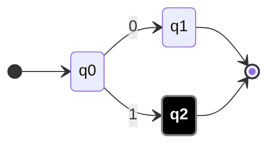
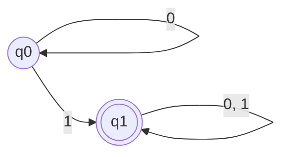

# Diagrams

```mermaid
stateDiagram-v2
    direction LR

    classDef Test fill:#000,color:white,font-weight:bold,stroke-width:2px,stroke:grey

    [*] --> q0
    q0 --> q1: 0
    q0 --> q2: 1

    q1 --> [*]
    q2 --> [*]

    class q2 Test
    class end Test
```

```mermaid
flowchart LR

    q0((q0))
    q0 -- 0 --> q0
    q0 -- 1 --> q1(((q1)))
    q1 -- 0, 1 --> q1


```

